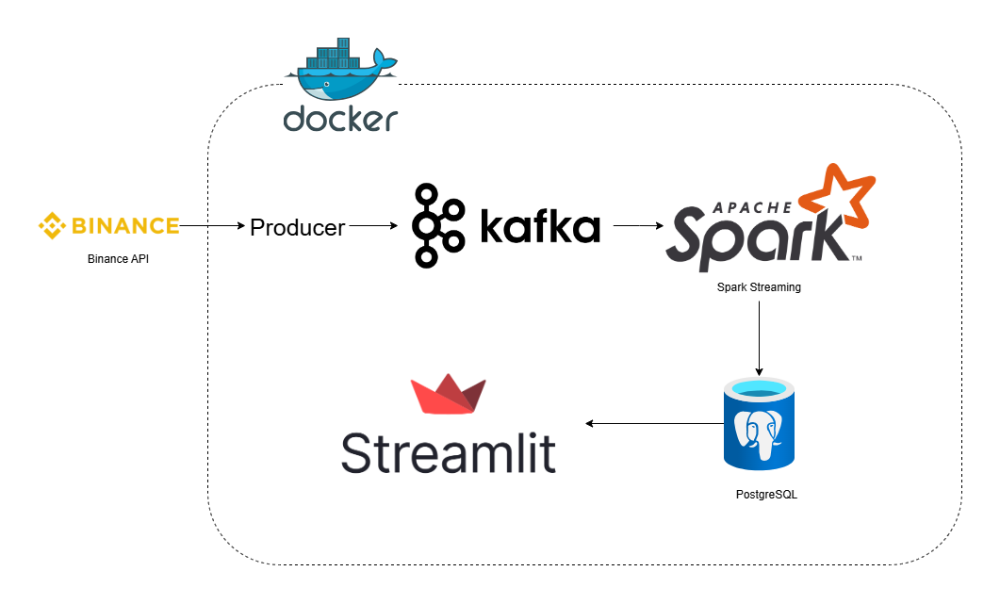

# Stock Market Real-Time Analysis

## Project Description
**Stock Market Real-Time Analysis** is a full-fledged real-time analytics platform for monitoring stock market activities. The system fetches live trading data from the Binance API and processes it using a robust streaming pipeline built with **Kafka** and **Apache Spark**.  

Key features include:
- Real-time calculation of stock market metrics:
  - Average Price
  - Total Traded Quantity
  - Traded Value
  - Average Quantity
  - Volatility
  - Buy/Sell Counts
  - Buy/Sell Ratio
  - Trade Count
- Continuous storage of processed data in **PostgreSQL**
- Interactive **Streamlit** dashboard with dynamic charts that update every few seconds
- Fully containerized using **Docker** for easy deployment and scalability

## Architecture
The system pipeline is as follows:
1. **Binance API** → fetches live stock market data
2. **Kafka Producer** → sends the data to Kafka topics
3. **Spark Streaming** → processes the data and computes analytics in real-time
4. **PostgreSQL** → stores processed metrics
5. **Streamlit Dashboard** → visualizes the analytics and updates dynamically  

  
*Architecture diagram of the real-time stock market analysis system.*

## Installation & Running
To run the project, make sure you have **Docker** and **Docker Compose** installed. Then, follow these steps:

1. Clone the repository:
```bash
git clone https://github.com/yourusername/stock-market-realtime-analysis.git
cd stock-market-realtime-analysis

2. Build and run all services using Docker Compose:
```bash
docker-compose up -d

3. Access the Streamlit Dashboard:
Open your browser and go to: http://localhost:8501

To stop the project:
```bash
docker-compose down